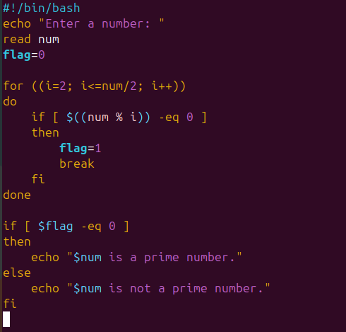
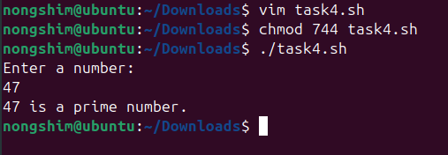
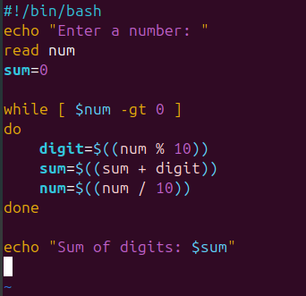
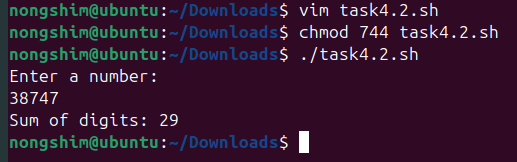
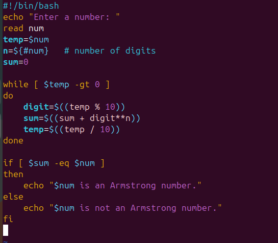
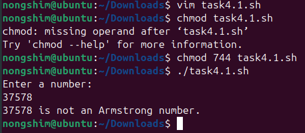

# <h1 style="background-color: orange;"> EXPERIMENT 5 - Shell Programming</h1>

---------------------------------------------------------------------------

Name: Keshav Chadha  SAP id:590028683

---------------------------------------------------------------------------

##  Aim

&nbsp;  To learn the Conditional statements, Loops and decision making in Shell scripting.

---------------------------------------------------------------------------

## Tools & Software Used 

- Operating System: Ubuntu running on Oracle VirtualBox  

- Terminal Emulator: GNOME Terminal 

- Shell: Bash (Bourne-Again Shell)

---------------------------------------------------------------------------

## <h1 style="background-color: pink;">TASK 1: Prime Number Check</h1>

&nbsp;#### Write a script that takes a number as input and checks whether it is a prime number or not.  

&nbsp;  Script:

&nbsp;    

&nbsp;  Output:

&nbsp;    

---------------------------------------------------------------------------

## <h1 style="background-color: pink;">TASK 2: Sum of Digits</h1>

&nbsp; #### Write a script that calculates the sum of the digits of a given number.   

&nbsp;  Script:

&nbsp;    

&nbsp;  Output:

&nbsp;    

---------------------------------------------------------------------------

## <h1 style="background-color: pink;">TASK 3: Armstrong Number</h1>

&nbsp;  Create a script that checks whether a given number is an Armstrong numberor not.  

&nbsp;  Script:

&nbsp;    

&nbsp;  Output:

&nbsp;    

---------------------------------------------------------------------------

<h1 style="background-color: pink;"> OBSERVATIONS</h1>

&nbsp;- The prime number script correctly identified whether the input number was prime or not.

&nbsp;- The sum of digits script accurately calculated the sum of digits for all tested inputs.

&nbsp;- The Armstrong number script successfully verified if a number was an Armstrong number.

&nbsp;- Conditional statements (if, else) worked as expected to control the flow of the scripts.

&nbsp;- Loops (for, while) efficiently handled repetitive operations like digit extraction and number checking.

---------------------------------------------------------------------------

## <h1 style="background-color: pink;"> CONCLUSION</h1> 

&nbsp;- Conditional statements and loops were effectively used in all scripts.

&nbsp;- The tasks proved that decision-making in shell scripting can be applied to solve mathematical problems.

&nbsp;- The experiment enhanced understanding of logic implementation in Linux shell scripting.

---------------------------------------------------------------------------

