# <h1 style="background-color: orange;"> EXPERIMENT 6 - Shell Programming</h1>

---------------------------------------------------------------------------

Name: Keshav Chadha  SAP id:590028683   

---------------------------------------------------------------------------

## Aim

&nbsp;  To understand and practically apply Shell Loops, Loop Control statements, Input/Output Redirections, Shell Functions, Regular Expressions, and Script Debugging in Linux

---------------------------------------------------------------------------

## Tools \& Software Used 

- Operating System: Ubuntu running on Oracle VirtualBox  

- Terminal Emulator: GNOME Terminal 

- Shell: Bash (Bourne-Again Shell)

---------------------------------------------------------------------------

## <h1 style="background-color: pink;">Loops</h1>

&nbsp;

&nbsp;  1.`for` loop:

&nbsp;   Script:

&nbsp;  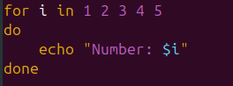  

&nbsp;

&nbsp;   Output:

&nbsp;  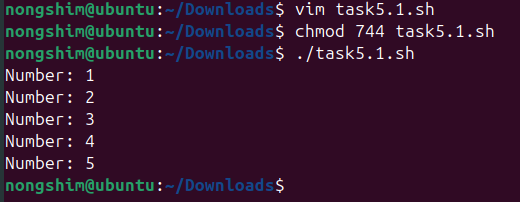  

&nbsp;  2.`while` loop:

&nbsp;   Script:

&nbsp;  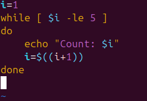  

&nbsp;

&nbsp;   Output:

&nbsp;  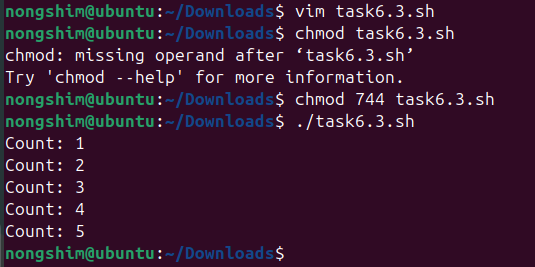   

&nbsp;  

&nbsp;  3.`until` loop:

&nbsp;   Script:

&nbsp;  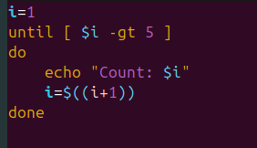  

&nbsp;

&nbsp;   Output:

&nbsp;  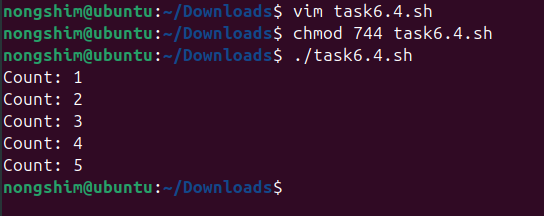  

---------------------------------------------------------------------------   

## <h1 style="background-color: pink;">Loop Control using `continue` \& `break`</h1>

&nbsp; Using `continue` and `break`:

&nbsp;  Script:

&nbsp;  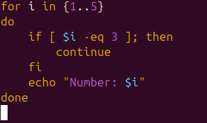  

&nbsp;

&nbsp;   Output:

&nbsp;  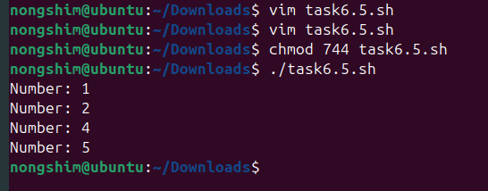   

---------------------------------------------------------------------------

## <h1 style="background-color: pink;">Shell Functions</h1>

&nbsp; 1. Greeting function:

&nbsp;   Script:

&nbsp;  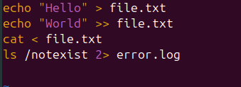  

&nbsp;

&nbsp;   Output:

&nbsp;  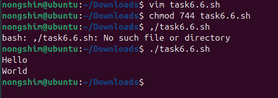  

&nbsp; 2. Multiplication table function:

&nbsp;   Script:

&nbsp;  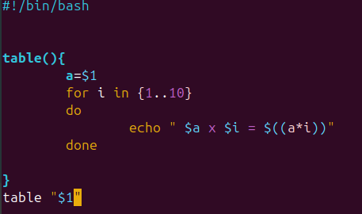  

&nbsp;

&nbsp;   Output:

&nbsp;  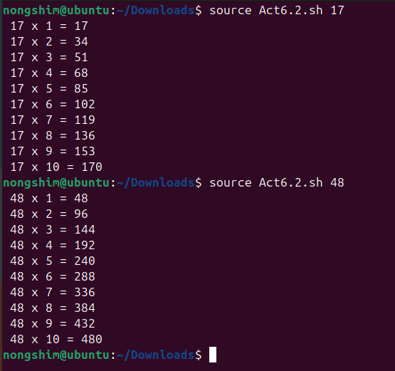   

---------------------------------------------------------------------------

## <h1 style="background-color: pink;">Lab Exercises</h1>

&nbsp; TASK 1: Palindrome Check

&nbsp;   Script:

&nbsp;  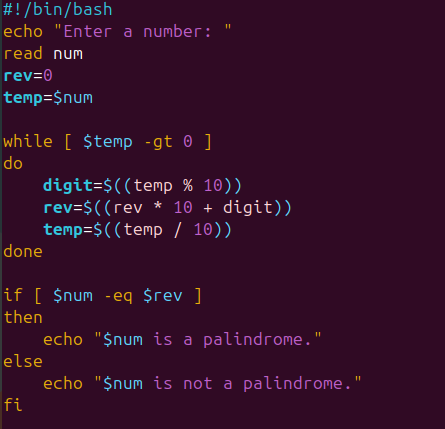  

&nbsp;

&nbsp;   Output:

&nbsp;  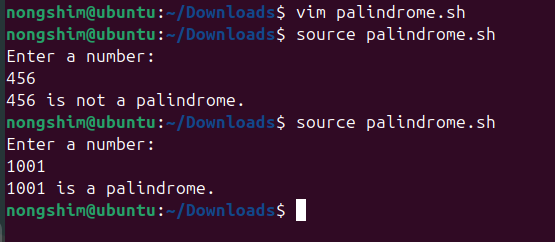  

&nbsp;

&nbsp; TASK 2: GCD \& LCM

&nbsp;   Script:

&nbsp;  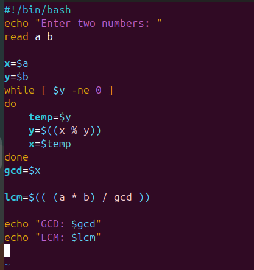  

&nbsp;

&nbsp;   Output:

&nbsp;  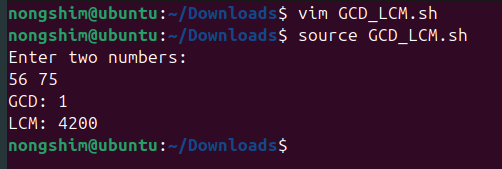  

&nbsp; TASK 3: Sorting Numbers

&nbsp;   Script:

&nbsp;  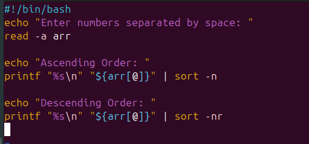  

&nbsp;

&nbsp;   Output:

&nbsp;  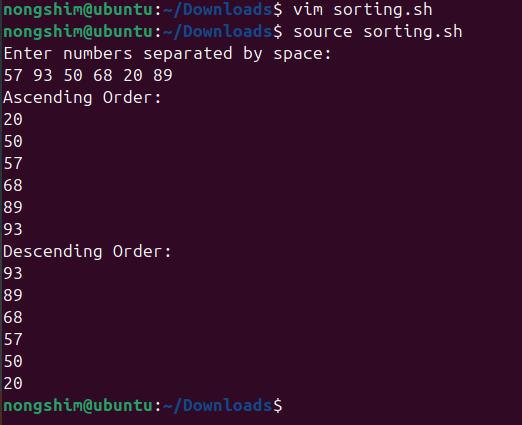  

---------------------------------------------------------------------------

## <h1 style="background-color: pink;"> OBSERVATIONS</h1>

- Loops and loop control statements executed correctly.

- Shell functions allowed reusable code blocks.

---------------------------------------------------------------------------

## <h1 style="background-color: pink;"> CONCLUSION</h1> 

&nbsp;Learned to use loops, functions, IO redirection, and regex in Bash scripts

---------------------------------------------------------------------------

