# <h1 style="background-color: orange;"> EXPERIMENT 7 - Shell Programming</h1>
---------------------------------------------------------------------------
Name: Keshav  Chadha   SAP id:590029184    Date:25/09/2025

---------------------------------------------------------------------------
##  Aim
   **To understand and practically apply process management commands, viewing and monitoring processes, terminating, process priortization and scheduling**

---------------------------------------------------------------------------
## Tools & Software Used 
- **Operating System:** Ubuntu running on Oracle VirtualBox  
- **Terminal Emulator:** GNOME Terminal 
- **Shell:** Bash (*Bourne-Again Shell*)

---------------------------------------------------------------------------
## <h1 style="background-color: pink;">Basic Process Commands</h1>
 #### 1. `   ps   ` - shows currently running processes 
  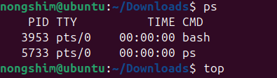 <br><br><br><br>

 #### 2. `   top   ` - shows running processes dynamically with their CPU and memory usage 
  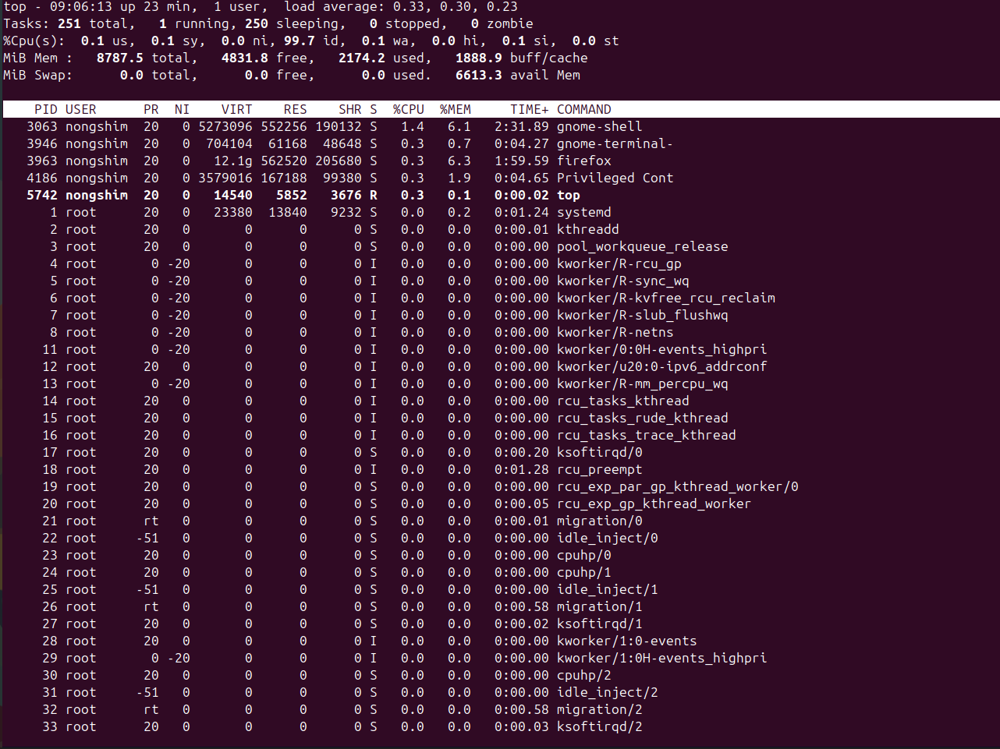 <br><br><br><br>

 #### 3. `   pstree   ` - shows process hierarchy
   <br><br><br><br>

 #### 4. `   kill<PID>   ` - stops the proccess
  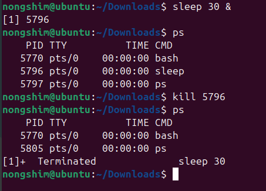 <br><br><br><br>

---------------------------------------------------------------------------
## <h1 style="background-color: pink;">Process Priotization</h1>

 #### 1. `    nice -n <value> command    ` - starts a process with a specific priority
   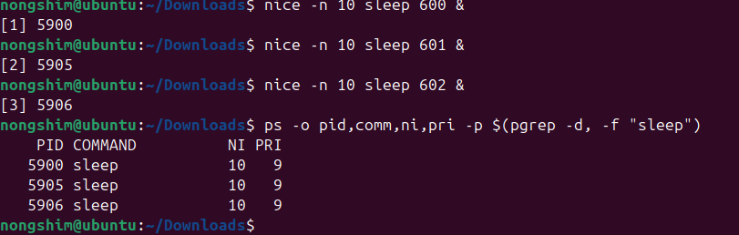 <br><br><br><br>

 #### 2. `    renice <value> - p <PID>    ` - change priority of a runnung process
   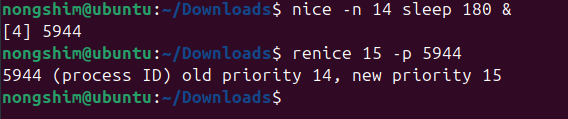 <br><br><br><br>

---------------------------------------------------------------------------
## <h1 style="background-color: pink;">Process Scheduling</h1> 

 #### 1. `    at <TIME>   ` - schedules one time tasks (*works only with mins, hours & days*)
    <br><br>

 #### 2. `    cron    ` - runs specific tasks at given time / dates

```
*  *  *  *  *  command
│  │  │  │  │
│  │  │  │  └── Day of week (0–6, Sunday=0)
│  │  │  └──── Month (1–12)
│  │  └─────── Day of month (1–31)
│  └────────── Hour (0–23)
└───────────── Minute (0–59)

 ```

    <br><br>
    <br><br>

---------------------------------------------------------------------------
## <h1 style="background-color: pink;">LAB Exericeses</h1>

 ### <h1 style="background-color: lightgreen;">TASK 1: File existence Check</h1>
   #### Script:
   <br><br>
  
   #### Output:
   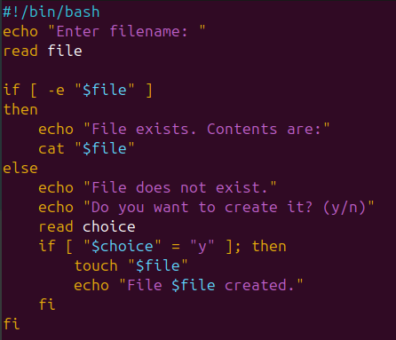<br><br>

 ### <h1 style="background-color: lightgreen;">TASK 2: Print no.'s from 1 to 10</h1>
   #### Script:
   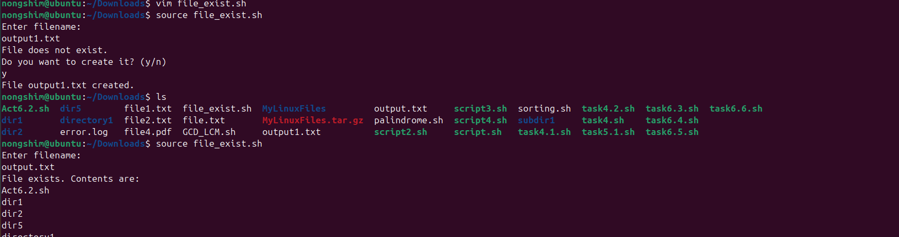<br><br>
  
   #### Output:
   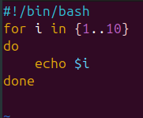<br><br>

 ### <h1 style="background-color: lightgreen;"> TASK 3: Count lines, words and characters in a file</h1>
   #### Script:
   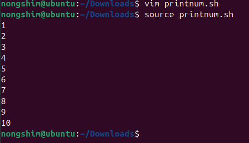<br><br>
  
   #### Output:
   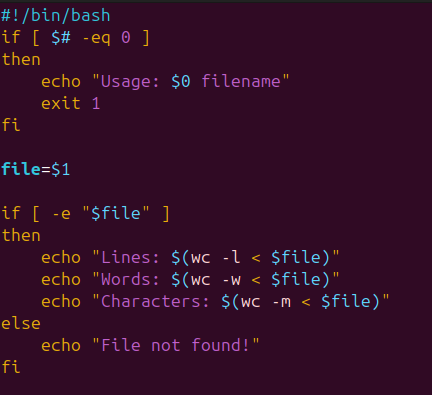<br><br>

 ### <h1 style="background-color: lightgreen;">TASK 4: Factorial of a number using funtion</h1>
   #### Script:
   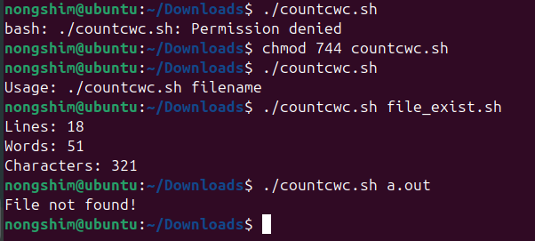<br><br>
  
   #### Output:
   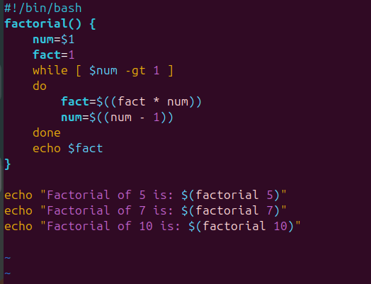<br><br>

---------------------------------------------------------------------------
## <h1 style="background-color: pink;">OBSERVATIONS</h1>

 - Successfully viewed running processes using ps, top, and pstree.

 - Able to terminate processes using kill and control their priority with nice and renice.

 - Scheduled tasks using at for one-time execution and cron for recurring jobs.

 
---------------------------------------------------------------------------
## <h1 style="background-color: pink;">CONCLUSION</h1> 
The experiment enhanced understanding of Linux process management and scheduling.


---------------------------------------------------------------------------
---------------------------------------------------------------------------

