# Experiment 9: Shell Programming
**Name:** Keshav Chadha
**Roll No.:** 590029233

# Requirements:
* Operating System: Ubuntu running on Oracle VirtualBox
* Shell: Bash (Bourne-Again Shell)
***
***
# Theory
## 1. System Performance Monitoring
* `top` → live CPU & memory usage per process.
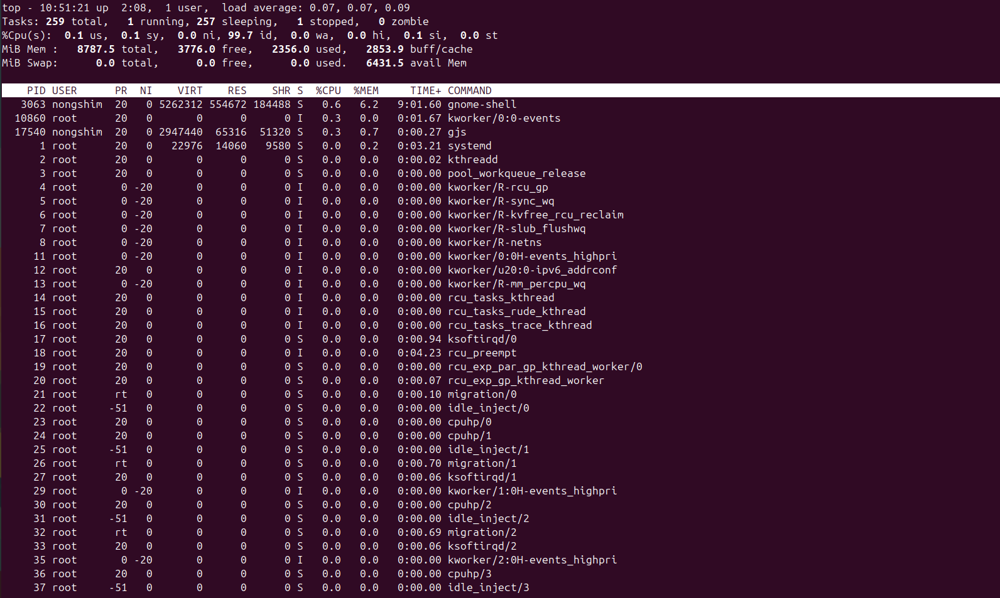
* `htop` → improved version of `top` (if installed).
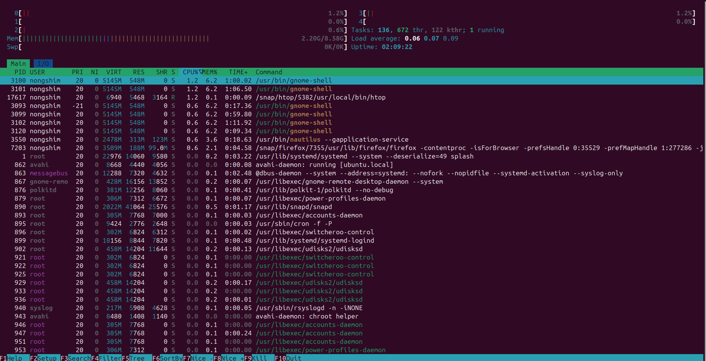
* `free -h` → memory usage in human-readable form.
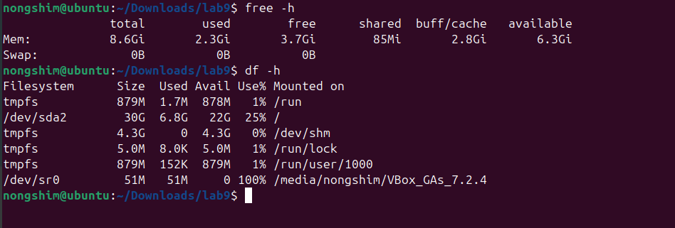
* `df -h` → disk space usage.
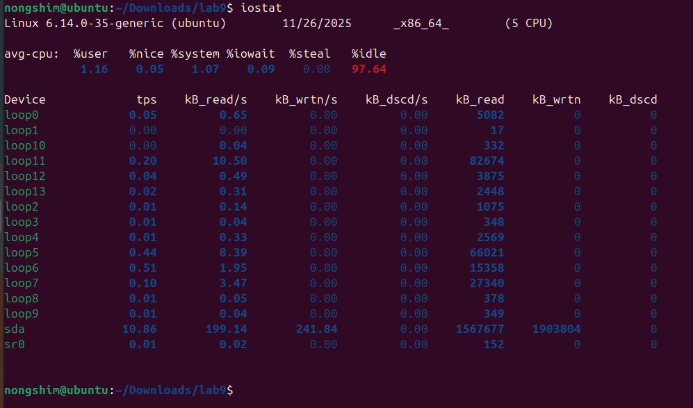
* `iostat` → input/output statistics (may need `sysstat` package).
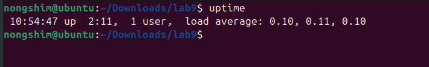
* `uptime` → system load averages (1, 5, 15 minutes).
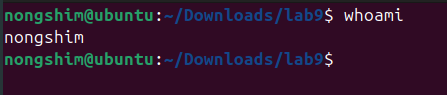

## 2. System Security and User Management
* `whoami` → current user.

* `id` → user & group info.
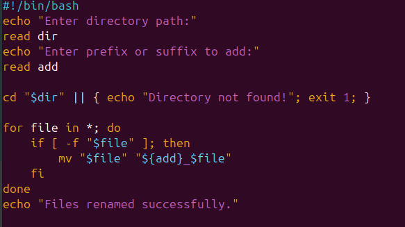
* `groups` → display user’s groups.
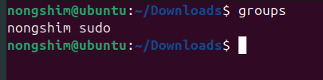

# Lab
## i. Rename All Files in a Directory
```bash
#!/bin/bash
echo "Enter directory path:"
read dir
echo "Enter prefix or suffix to add:"
read add

cd "$dir" || { echo "Directory not found!"; exit 1; }

for file in *; do
    if [ -f "$file" ]; then
        mv "$file" "${add}_$file"
    fi
done
echo "Files renamed successfully."
```

Output:
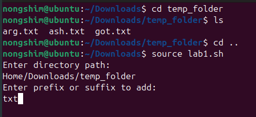

## ii. Search Files by Extension or Size
```bash
#!/bin/bash
echo "Enter directory to search:"
read dir
echo "Enter file extension (e.g. .txt):"
read ext
echo "Enter minimum size in KB:"
read size

find "$dir" -type f -name "*$ext" -size +"${size}k"
```

Output:
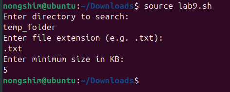

## iii. Fibonacci Series
```bash
#!/bin/bash
echo "Enter the number of terms:"
read n

a=0
b=1
echo "Fibonacci Series:"
for ((i=0; i<n; i++))
do
    echo -n "$a "
    fn=$((a + b))
    a=$b
    b=$fn
done
echo
```

Output:
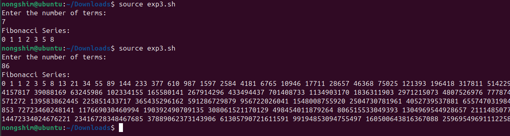

***

# OBERVATIONS
*

***

# CONCLUSION
The experiment helped in understanding advanced file and directory operations in Linux, enhancing efficiency in file management through searching, archiving, compression, and linking techniques.


***
