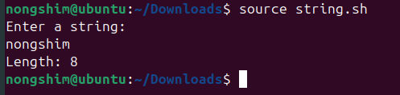
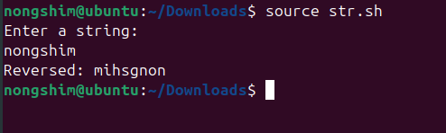
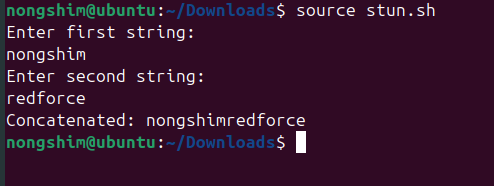

# Experiment 10: Shell Programming – String Operations
### Name: Keshav Chadha
### GLOBAL ID: 590029233
---
## Aim
To write and execute shell scripts for performing basic string operations such as calculating string
length, reversing strings, and concatenating strings.
---
## Requirements
- Linux system with Bash shell
- Basic knowledge of shell variables and string handling
---
# Exercise 1: Find the Length of a String
### Task Statement
Write a shell script that takes a string as input and prints its length.
### Procedure
1. Prompt the user to enter a string.
2. Store the string in a variable.
3. Use `${#variable}` to find the string length.
4. Display the result.
### Observations
- When the user enters a string, the script displays the correct number of characters.
- Works for strings with or without spaces (if quoted properly).
### Script
```bash
#!/bin/bash
echo "Enter a string:"
read str
echo "Length: ${#str}"
```
### Output

<p align="center">

</p>


### Explanation
- `${#str}` is a **bash parameter expansion** that directly returns the length of the string.
- This is more efficient than using `echo $str | wc -c`, which requires subshells and pipes.
---
# Exercise 2: Reverse a String
### Task Statement
Write a shell script that reverses a given string.
### Procedure
1. Prompt the user to enter a string.
2. Calculate its length using `${#str}`.
3. Loop backward from the last character to the first using a `for` loop.
4. Append each character in reverse order to a new variable.
5. Print the reversed string.
### Observations
- The reversed string output was correct for all test inputs.
- Works without using the external `rev` command, purely in bash.
### Script
```bash
#!/bin/bash
echo "Enter a string:"
read str
rev=""
len=${#str}
for (( i=$len-1; i>=0; i-- ))
do
rev="$rev${str:$i:1}"
done
echo "Reversed: $rev"
```
### Output

<p align="center">

</p>


### Explanation
- `${str:$i:1}` extracts one character from position `$i`.
- The loop starts from the last index and appends each character to form the reversed string.
- Alternatively, the command `echo $str | rev` can be used if the `rev` utility is installed.
---
# Exercise 3: Concatenate Two Strings
### Task Statement
Write a shell script to read two strings and concatenate them.
### Procedure
1. Ask the user to input the first string and store it in `s1`.
2. Ask for the second string and store it in `s2`.
3. Print the combined string using variable concatenation (`$s1$s2`).
### Observations
- The output correctly displayed the combined result of the two strings.
- Works without requiring any external utilities.
### Script
```bash
#!/bin/bash
echo "Enter first string:"
read s1
echo "Enter second string:"
read s2
echo "Concatenated: $s1$s2"
```
### Output

<p align="center">

</p>

---

### Explanation
- In bash, simply placing variables next to each other concatenates them.
- No special operator (like `+`) is needed.
- For example: `x="Hello"` and `y="World"` → `echo "$x$y"` prints `HelloWorld`.
---
# Result
Successfully executed and verified scripts for string length calculation, string reversal, and string
concatenation.
---
# Conclusion
This experiment strengthened understanding of **string manipulation** in bash, including parameter

expansion, string slicing, and concatenation without external tool
